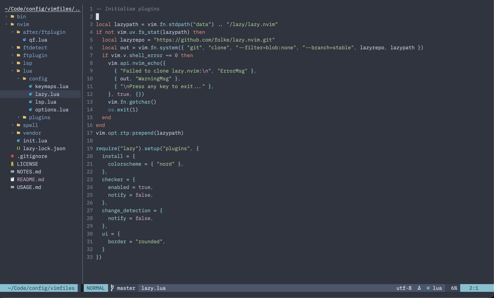

# Vimfiles

My Neovim configuration, using the Nordic theme. Leader is `,`, escape is `kj`,
and formatting is manual rather than on-save.



## Prerequisites

- Curl
- Git
- Neovim 0.12+
- tree-sitter CLI 0.26.1+ (`brew install tree-sitter-cli`)
- "Nerd font" variant of the font you're using in the terminal (required for Nordic theme icons)

### LSP servers

Install the language servers for the languages you use:

```bash
brew install marksman                                 # Markdown
brew install llvm                                     # C/C++ (provides clangd)
brew install haskell-language-server
brew install clojure-lsp/brew/clojure-lsp-native
brew install lua-language-server
gem install ruby-lsp
npm install -g pyright                                # Python
npm install -g typescript-language-server typescript  # TypeScript & JavaScript
npm install -g vscode-langservers-extracted           # HTML, CSS, JSON
npm install -g yaml-language-server
```

## Install

```bash
git clone https://github.com/davejacobs/vimfiles.git
cd vimfiles
bin/link
```

## Usage

See [USAGE](/USAGE.md) for keybindings, plugin details, and how to add language support.
